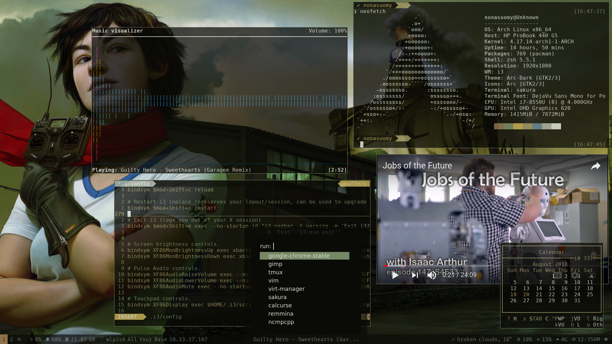

# Dot Files

Arch + i3WM Environment



**Dependencies**

```
pacman -S compton rofi sakura zathura xdotool feh i3-gaps vim gvim onboard scrot powerline ttf-font-awesome ttf-dejavu zsh gnome-calculator sound-theme-freedesktop xorg-xrandr xorg-xdpyinfo imagemagick bc neofetch calcurse qutebrowser python-pywal
```

**AUR**

```
git clone https://aur.archlinux.org/polybar.git
git clone https://aur.archlinux.org/conky-lua.git
git clone https://aur.archlinux.org/google-chrome.git
git clone https://aur.archlinux.org/ttf-dejavu-sans-mono-powerline-git.git
git clone https://aur.archlinux.org/i3lock-color.git
git clone https://aur.archlinux.org/betterlockscreen.git
git clone https://aur.archlinux.org/oh-my-zsh-git.git
git clone https://aur.archlinux.org/wpgtk-git.git
```

**Oh-My-ZSH**

Install

via curl

```
sh -c "$(curl -fsSL https://raw.githubusercontent.com/robbyrussell/oh-my-zsh/master/tools/install.sh)"
```

via wget

```
sh -c "$(wget https://raw.githubusercontent.com/robbyrussell/oh-my-zsh/master/tools/install.sh -O -)"
```

Grab agnoster_modified.zsh-theme 

```
wget https://github.com/NonaSuomy/dotfiles/raw/master/.oh-my-zsh/themes/agnoster_modified.zsh-theme -P ~/.oh-my-zsh/themes/
```

Grab .zshrc

```
wget https://github.com/NonaSuomy/dotfiles/raw/master/.zshrc -P ~/
```

**Sound Test**

```
paplay /usr/share/sounds/freedesktop/stereo/audio-volume-change.oga
```

**Setup Lock Screen**

```
wget https://github.com/NonaSuomy/dotfiles/raw/master/.i3/wallpapers/wakeupbaby.jpg -P ~/.config/i3/wallpapers/
~/.config/i3/scripts/betterlockscreen -u ~/.config/i3/wallpapers/wakeupbaby.jpg
```

Test Lock Screen 

```~/.config/i3/scripts/betterlockscreen -l blur```

**VIM Plugins**

```
git clone https://github.com/VundleVim/Vundle.vim.git ~/.vim/bundle/Vundle.vim
vim +PluginInstall +qall
```

**pywal + wpgtk**

```
wpg-install.sh -Igrip
```

